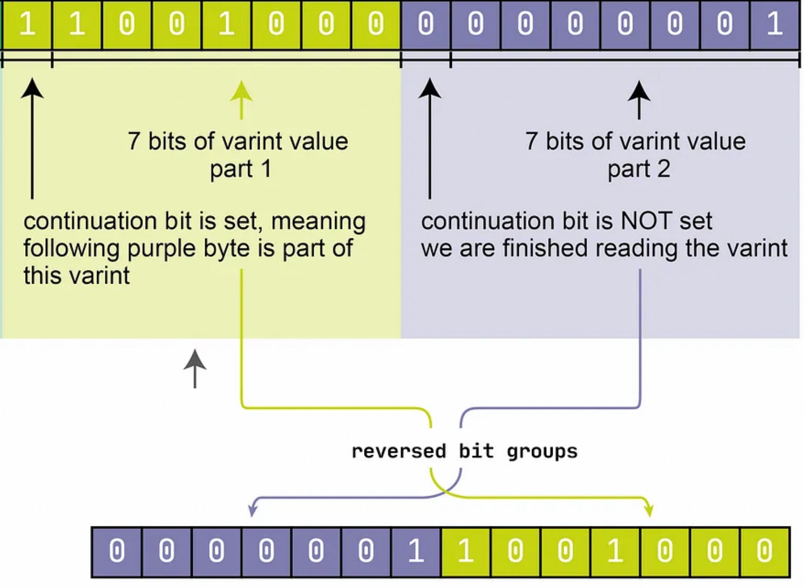
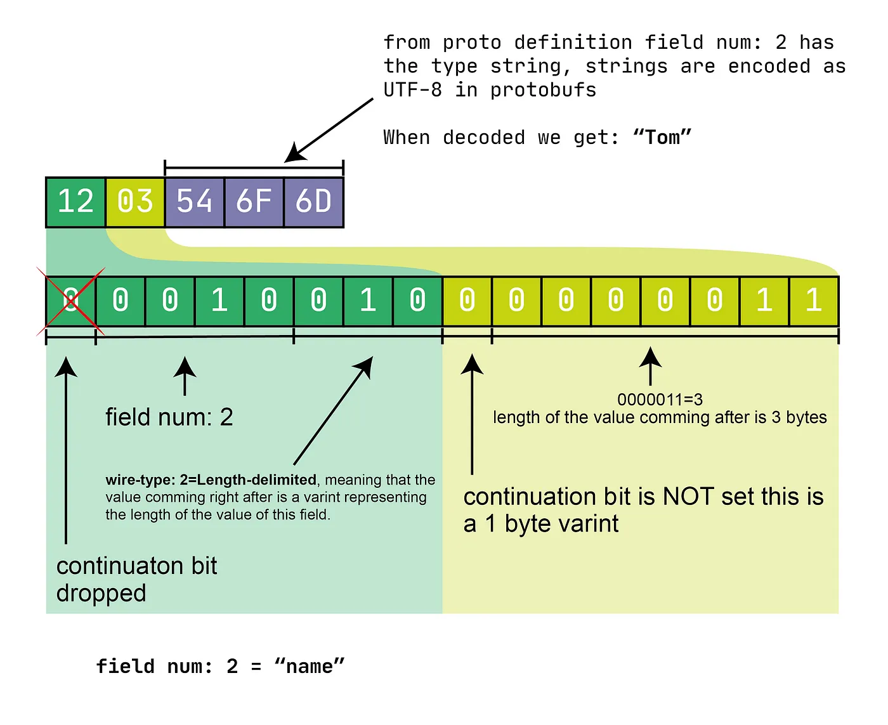

protobuf 二进制格式说明

# 基本格式
protobuf 的消息字段二进制格式是按照key-value方式一个个排列的，key是varint 编码的值，它由字段编号和类型组成：(field_number << 3 | wire_type)，key 也被称为tag。tag的最后的3个bit位始终用来表示value的wire_type。

为什么用3 bit来表示wire_type呢？因为protobuf 只有6 种wire_typ：VARINT、I64、LEN、SGROUP、EGROUP 和 I32，刚好可以用3 bit表示。

ID  | Name   | Used For
--- | ------ | --------------------------------------------------------
0   | VARINT | int32, int64, uint32, uint64, sint32, sint64, bool, enum
1   | I64    | fixed64, sfixed64, double
2   | LEN    | string, bytes, embedded messages, packed repeated fields
3   | SGROUP | group start (deprecated)
4   | EGROUP | group end (deprecated)
5   | I32    | fixed32, sfixed32, float

# variant 编码
普通的 int32 数据类型, 无论其值的大小, 所占用的存储空间都是4字节是相等的, 是否可以根据数值的大小来动态地占用存储空间, 使得值比较小的数字占用较少的字节数, 值相对比较大的数字占用较多的字节数, 这便是变长整型编码的基本思想, 采用变长整型编码的数字, 其占用的字节数是变化的，不一定是固定字节数, 为了达到这一点, Varints 编码使用每个字节的最高有效位(MSB)作为标志位, 而剩余的 7 位来存储数字值本身, 当最高有效位为 1 时, 代表其后还跟有字节, 当最高有效位为 0 时, 代表已经是该数字的最后的一个字节, 在 Protobuf 中, 使用的是 Base128 Varints 编码, 之所以叫这个名字原因即是在这种方式中, 使用 7 bit 来存储数字。在 Protobuf 中, Base128 Varints 采用的是小端序, 即数字的低位存放在高地址。（https://sunyunqiang.com/blog/protobuf_encode/）

举例来看, 对于数字 1, 我们假设 int 类型占 4 个字节, 以标准的整型存储, 其二进制表示应为

00000000 00000000 00000000 00000001
可见, 只有最后一个字节存储了有效数值, 前 3 个字节都是 0, 若采用 Varints 编码, 其二进制形式为

00000001

因为其没有后续字节, 因此其最高有效位为 0，因此本来占4 字节的整数现在只需要占 1 字节了。再比如数字 666, 其以标准的整型存储, 其二进制表示为

00000000 00000000 00000010 10011010
而采用 Varints 编码, 其二进制形式为

10011010 00000101

这个Varint 如何还原成原来的二进制呢？

先去掉两个字节的最高位：

0011010 0000101

再交换字节位置：

0000101 0011010 --> 00001010011010 --> 00000010 10011010

最终还原成原始的二进制。

下面是一个值为200的数字的varint的二进制格式(https://levelup.gitconnected.com/protobufs-explained-17ed6ba52076)：



第一个字节最高位为1表示varint后续还有字节，第二个字节最高位为0表示它是varint 最后一个字节了。

去掉两个最高位，然后交换字节，得到原始的二进制。

## ZigZag
intN类型将负数编码为二进制补码，这意味着作为无符号 64 位整数，它们设置了最高位。因此，这意味着必须使用所有十个字节。例如，-2转换为
```cpp
11111110 11111111 11111111 11111111 11111111
11111111 11111111 11111111 11111111 00000001
```
这是 2 的二进制补码，在无符号算术中定义为~0 - 2 + 1，其中~0是全 1 的 64 位整数。(https://protobuf.dev/programming-guides/encoding)

负数采用 Base128 Varints 编码后将恒定占用 10 个字节的空间, 可见 Varints 编码对于表示负数毫无优势, 甚至比普通的固定 32 位存储还要多占 4 个字节。Varints 编码的实质在于设法移除数字开头的 0 比特, 而对于负数, 由于其数字高位都是 1, 因此 Varints 编码在此场景下失效, Zigzag 编码便是为了解决这个问题, Zigzag 编码的大致思想是首先对负数做一次变换, 将其映射为一个正数, 变换以后便可以使用 Varints 编码进行压缩, 这里关键的一点在于变换的算法, 首先算法必须是可逆的, 即可以根据变换后的值计算出原始值, 否则就无法解码, 同时要求变换算法要尽可能简单, 以避免影响 Protobuf 编码、解码的速度。（https://sunyunqiang.com/blog/protobuf_encode/）

sintN使用“ZigZag”编码而不是二进制补码来编码负整数。正整数p编码为`2 * p`（偶数），而负整数n编码为`2 * |n| - 1`（奇数）。因此，编码在正数和负数之间“zig-zag”。例如

Signed Original | Encoded As
--------------- | ----------
0               | 0
-1              | 1
1               | 2
-2              | 3
...             | ...
0x7fffffff      | 0xfffffffe
-0x80000000     | 0xffffffff

换句话说，每个值 n 使用以下方式编码
```cpp
(n << 1) ^ (n >> 31)
```
对于 sint32，或
```cpp
(n << 1) ^ (n >> 63)
```
对于 64 位版本。

解析 sint32 或 sint64 时，其值会解码回原始的带符号版本。

# 一个简单的protobuf 字段的二进制格式
```cpp
message object {
  string name = 2;
}
```
假设name的值为"tom"，protobuf二进制格式如下：



# TLV格式
对于wire_type 类型为LEN(string, bytes, embedded messages, packed repeated fields)的字段来说，它的长度是变化的，因此这类字段需要在在tag 部分后面增加length部分（length也是varint编码的），它的二进制格式就是tag-length-value格式的，简称为TLV格式。

非LEN 类型的要么是varint要么是定长的，可以间接或直接得到字节数，所以不需要增加length部分，因此它们是tag-value格式的，即TV格式。

# oneof 类型
oneof 的编码方式与字段不在 oneof 中相同。

# repeated
就是简单的把每个字段依次序列化。

# packed
proto3 reapeated 标量数值类型默认是packed，packed时会按照LEN(TLV) 格式来编码。

## map 类型
映射字段只是特殊类型的重复字段的简写。如果我们有
```cpp
message Test6 {
  map<string, int32> g = 7;
}
```
这实际上与
```cpp
message Test6 {
  message g_Entry {
    optional string key = 1;
    optional int32 value = 2;
  }
  repeated g_Entry g = 7;
}
```
相同。因此，映射的编码方式与 repeated 消息字段完全相同：作为 LEN 类型记录的序列，每个记录有两个字段。

# 默认值
TODO

proto3 是否会序列化默认值？
proto2 的行为是否和proto3 一致？